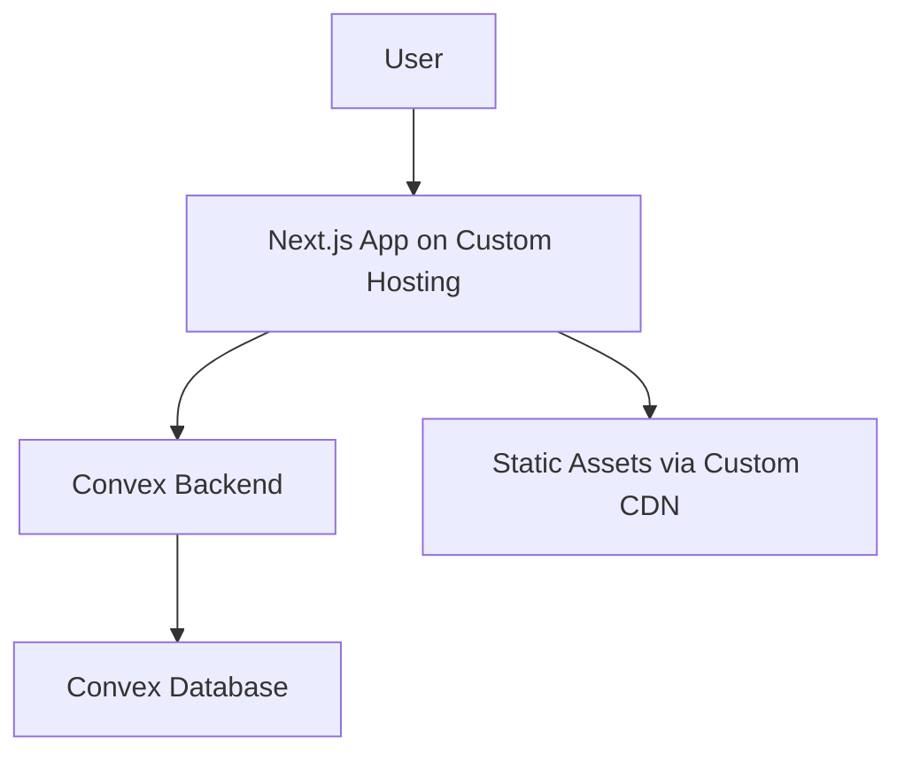
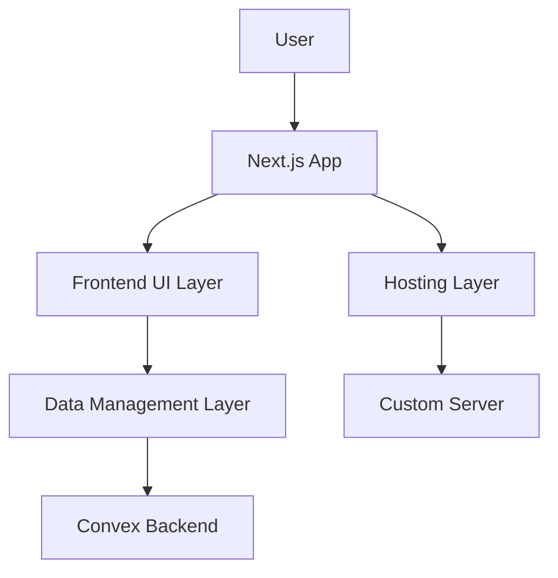
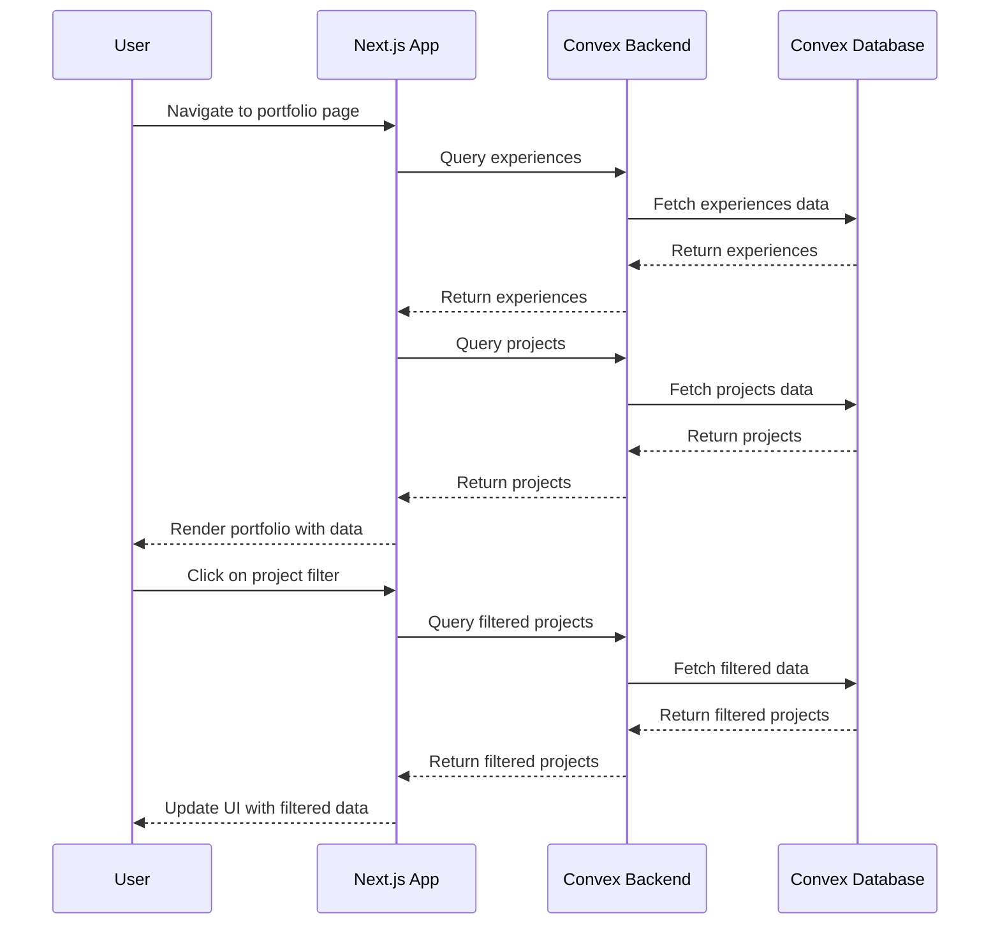

# Portfolio Fullstack Architecture Document

## Introduction

This document outlines the complete fullstack architecture for Portfolio, including backend systems, frontend implementation, and their integration. It serves as the single source of truth for AI-driven development, ensuring consistency across the entire technology stack.

This unified approach combines what would traditionally be separate backend and frontend architecture documents, streamlining the development process for modern fullstack applications where these concerns are increasingly intertwined.

### Starter Template or Existing Project
N/A - Existing project

### Change Log
| Date | Version | Description | Author |
|------|---------|-------------|--------|

## High Level Architecture

### Technical Summary
The Portfolio application follows a modern fullstack architecture combining server-side rendering with real-time data capabilities. The frontend is built with Next.js for optimal performance and SEO, while Convex provides the backend-as-a-service for data management and real-time queries. Key integration occurs through Convex
\s
React
hooks
enabling
seamless
data
fetching
and
mutations
directly
in
Next.js
components.
Infrastructure
leverages
custom
hosting
for
the
frontend
and
Convex\'s cloud database for scalable data storage. This architecture achieves the goal of migrating from static data to dynamic, manageable content for the portfolio site, supporting future features like admin panels or user interactions.

### Platform and Infrastructure Choice
**Platform:** Own Hosting + Convex  
**Key Services:** Next.js (frontend on custom host), Convex (backend database and queries), Custom hosting (CDN and deployment)  
**Deployment Host and Regions:** Custom hosting regions, Convex multi-region database  

### Repository Structure
**Structure:** Single repository  
**Monorepo Tool:** N/A  
**Package Organization:** Standard Next.js app structure with lib/ for utilities, app/ for pages, and convex/ for backend functions  

### High Level Architecture Diagram


### Architectural Patterns
- **Jamstack Architecture:** Static site generation with serverless APIs - _Rationale:_ Optimal performance and scalability for a content-heavy portfolio site with dynamic data needs
- **Component-Based UI:** Reusable React components with TypeScript - _Rationale:_ Maintainability and type safety across the codebase
- **Repository Pattern:** Convex handles data access and queries - _Rationale:_ Built-in abstraction for database operations, reducing boilerplate
- **API Gateway Pattern:** Convex as single backend entry point - _Rationale:_ Centralized data management and real-time capabilities

## Tech Stack

### Technology Stack Table
| Category | Technology | Version | Purpose | Rationale |
|----------|------------|---------|---------|-----------|
| Frontend Language | TypeScript | 5.x | Type-safe development | Ensures reliability and maintainability for complex portfolio features |
| Frontend Framework | Next.js | 15.x | SSR and routing | Optimal for SEO and performance in portfolio sites |
| UI Component Library | shadcn/ui | Latest | Consistent UI components | Provides high-quality, accessible components with Tailwind integration |
| State Management | React Hooks | Built-in | Local state | Sufficient for portfolio scale without complexity |
| Backend Language | N/A | N/A | N/A | Convex handles backend logic |
| Backend Framework | Convex | Latest | Data management and queries | Real-time backend-as-a-service for dynamic data |
| API Style | Convex Queries | N/A | Data fetching | Direct integration with React for seamless queries |
| Database | Convex | N/A | Data storage | Managed database with real-time capabilities |
| Cache | Convex built-in | N/A | Query caching | Automatic caching for performance |
| File Storage | Convex File Storage | N/A | Asset storage | Integrated file handling for portfolio assets |
| Authentication | None | N/A | Public portfolio | No auth needed for public site |
| Frontend Testing | Jest + React Testing Library | Latest | Unit testing | Standard for React apps |
| Backend Testing | Convex testing tools | Latest | API testing | Built-in testing for Convex functions |
| E2E Testing | Playwright | Latest | End-to-end | Comprehensive testing for user flows |
| Build Tool | Next.js built-in | N/A | Building | Integrated build system |
| Bundler | Webpack (via Next.js) | N/A | Bundling | Optimized for Next.js |
| IaC Tool | None | N/A | Infrastructure | Convex handles deployment |
| CI/CD | GitHub Actions | N/A | Automation | Standard for open-source projects |
| Monitoring | Custom hosting analytics | N/A | Usage tracking | Basic monitoring for portfolio |
| Logging | Console/Convex logs | N/A | Error logging | Sufficient for small scale |
| CSS Framework | Tailwind CSS | 4.x | Styling | Utility-first for rapid development |

## Data Models

### Experience
**Purpose:** Represents professional work history and career milestones for display in the portfolio.

**Key Attributes:**
- id: string - Unique identifier for the experience
- name: string - Company or organization name
- role: string - Job title or position
- period: string - Employment duration
- logo: string | null - Company logo URL
- url: string - Company website
- description: string - Brief role description
- initials: string | undefined - Fallback initials if no logo

**Relationships:**
- One-to-many with Projects (via experienceId)

**TypeScript Interface:**
```typescript
export interface Experience {
  id: string;
  name: string;
  role: string;
  period: string;
  logo: string | null;
  url: string;
  description: string;
  initials?: string;
}
```

### Project
**Purpose:** Showcases individual projects, work samples, and achievements.

**Key Attributes:**
- title: string - Project name
- role: string - Role in the project
- company?: string - Associated company
- experienceId?: string - Links to related experience
- date: string - Project timeline
- description: string[] - Detailed project description
- techStack: string[] - Technologies used
- link?: string - Project URL
- logo?: string - Project logo
- category: "work" | "personal" - Project type
- xp?: number - Experience points

**Relationships:**
- Many-to-one with Experience (via experienceId)

**TypeScript Interface:**
```typescript
export interface Project {
  title: string;
  role: string;
  company?: string;
  experienceId?: string;
  date: string;
  description: string[];
  techStack: string[];
  link?: string;
  logo?: string;
  category: "work" | "personal";
  xp?: number;
}
```

### Bookmark
**Purpose:** Curates external resources, tools, and inspirations related to development.

**Key Attributes:**
- title: string - Resource name
- description: string - Brief description
- techStack: string[] - Related technologies
- link: string - Resource URL
- category: string - Resource category
- logo: string - Resource logo

**Relationships:**
- None

**TypeScript Interface:**
```typescript
export interface Bookmark {
  title: string;
  description: string;
  techStack: string[];
  link: string;
  category: string;
  logo: string;
}
```

### FeaturedCompany
**Purpose:** Highlights a key company or achievement for emphasis.

**Key Attributes:**
- name: string - Company name
- role: string - Role at company
- period: string - Tenure period
- status: string - Current status
- description: string - Company description
- logo: string - Company logo
- link: string - Company URL
- highlights: string[] - Key achievements

**Relationships:**
- One-to-one with Experience (conceptual link)

**TypeScript Interface:**
```typescript
export interface FeaturedCompany {
  name: string;
  role: string;
  period: string;
  status: string;
  description: string;
  logo: string;
  link: string;
  highlights: string[];
}
```

## Components

### Frontend UI Layer
**Responsibility:** Renders portfolio data and handles user interactions using reusable React components.

**Key Interfaces:**
- Data props (experiences, projects, bookmarks)
- Event handlers for navigation and filtering

**Dependencies:** Convex queries for data, shadcn/ui for components, Tailwind for styling

**Technology Stack:** Next.js, React, TypeScript, Tailwind CSS

### Data Management Layer
**Responsibility:** Manages data fetching, caching, and mutations through Convex queries and functions.

**Key Interfaces:**
- Query hooks (useQuery for fetching)
- Mutation functions (for updates if needed)

**Dependencies:** Convex client library

**Technology Stack:** Convex

### Hosting and Deployment Layer
**Responsibility:** Serves the Next.js application and static assets.

**Key Interfaces:**
- HTTP requests for pages and API routes

**Dependencies:** Custom hosting infrastructure

**Technology Stack:** Custom hosting (e.g., Apache/Nginx), Node.js runtime

### Component Diagrams


## Core Workflows



## Database Schema

```typescript
import { defineSchema, defineTable } from "convex/server";
import { v } from "convex/values";

export default defineSchema({
  experiences: defineTable({
    id: v.id("experiences"),
    name: v.string(),
    role: v.string(),
    period: v.string(),
    logo: v.optional(v.string()),
    url: v.string(),
    description: v.string(),
    initials: v.optional(v.string()),
  }),

  projects: defineTable({
    id: v.id("projects"),
    title: v.string(),
    role: v.string(),
    company: v.optional(v.string()),
    experienceId: v.optional(v.id("experiences")),
    date: v.string(),
    description: v.array(v.string()),
    techStack: v.array(v.string()),
    link: v.optional(v.string()),
    logo: v.optional(v.string()),
    category: v.union(v.literal("work"), v.literal("personal")),
    xp: v.optional(v.number()),
  }).index("by_experience", ["experienceId"]),

  bookmarks: defineTable({
    id: v.id("bookmarks"),
    title: v.string(),
    description: v.string(),
    techStack: v.array(v.string()),
    link: v.string(),
    category: v.string(),
    logo: v.string(),
  }),

  featuredCompany: defineTable({
    id: v.id("featuredCompany"),
    name: v.string(),
    role: v.string(),
    period: v.string(),
    status: v.string(),
    description: v.string(),
    logo: v.string(),
    link: v.string(),
    highlights: v.array(v.string()),
  }),
});
```

## Frontend Architecture

### Component Structure
- **App Router**: Next.js 15 app directory for file-based routing and server components
- **UI Library**: shadcn/ui components with Tailwind CSS v4 for consistent styling
- **Animation**: Framer Motion for smooth transitions and micro-interactions
- **Data Layer**: Convex React hooks for real-time data fetching and mutations

### Key Components
- **Navbar**: Responsive navigation with theme toggle and mobile menu
- **ProjectShowcase**: Tabbed interface for work/personal projects with filtering
- **ProfessionalExperience**: Grid layout for company experiences with hover effects
- **TechnologiesAndTools**: Grid of technology icons with hover animations
- **VirtualPetGame**: Interactive sprite-based pet game using Kaplay.js (ECS architecture)
- **Card Components**: Reusable Card, CardHeader, CardContent, CardFooter with motion

### Routing Structure
### Routing Structure
- **Server State**: Convex for persistent data (experiences, projects, bookmarks)
- **Form State**: React Hook Form with Zod validation for any forms

### Performance Optimizations
- **Image Optimization**: Next.js Image component with lazy loading
- **Code Splitting**: Dynamic imports for heavy components
- **Static Generation**: ISR for content-heavy pages where applicable
## Backend Architecture

### Convex Setup
- **Database**: Convex'\''s serverless database with type-safe schema and automatic indexing
- **Functions**: Serverless functions for queries, mutations, and actions
- **Real-time**: Live queries and subscriptions for dynamic portfolio updates
- **Deployment**: Automatic scaling with global CDN for low-latency data access

### Authentication & Security
- **Auth System**: Convex Auth for secure user sessions (optional for admin features)
- **Public Access**: Portfolio data remains publicly readable without authentication
- **Data Validation**: Zod schemas integrated with Convex for runtime type checking
- **Rate Limiting**: Built-in protection against abuse

### API Structure
- **Queries**: Read operations for experiences, projects, bookmarks, featured company
  - `getExperiences`: Fetch all experiences with optional filtering
  - `getProjects`: Retrieve projects by category or experience
  - `getBookmarks`: Get bookmarks by category
- **Mutations**: Write operations for content management
  - `addExperience`: Create new experience entry
  - `updateProject`: Modify project details
- **Actions**: Complex operations like data imports or bulk updates

### Data Flow Architecture
```
Frontend (React Components)
    ↓ (Convex React hooks)
Convex Client
    ↓ (HTTP/WebSocket)
Convex Backend
    ↓ (Type-safe Operations)
Convex Database
```

### Performance & Scalability
- **Caching**: Convex'\''s built-in caching for frequently accessed data
- **Indexing**: Optimized queries with database indexes on common filters
- **CDN**: Global distribution for fast content delivery
- **Monitoring**: Built-in analytics and error tracking
## Unified Project Structure

### Root Directory Layout
```
portfolio/
├── app/                    # Next.js 15 App Router
│   ├── api/               # API routes (if needed)
│   ├── bookmarks/         # Bookmarks page
│   ├── process/           # Process showcase page
│   ├── globals.css        # Global styles
│   ├── layout.tsx         # Root layout
│   └── page.tsx           # Home page
├── components/            # React components
│   ├── ui/               # Base UI components (shadcn/ui)
│   └── ...               # Feature components
├── convex/               # Convex backend
│   ├── schema.ts         # Database schema
│   ├── queries.ts        # Read operations
│   ├── mutations.ts      # Write operations
│   └── actions.ts        # Complex operations
├── lib/                  # Utilities and configurations
│   ├── data.ts           # Static data (to be migrated)
│   ├── appwrite.ts       # Appwrite config (if used)
│   └── resume-utils.ts   # Resume utilities
├── public/               # Static assets
│   ├── devs/            # Developer assets
│   └── pet/             # Pet sprites
├── docs/                 # Documentation
│   └── architecture.md  # This document
└── package.json          # Dependencies
```

### Convex Backend Organization
- **schema.ts**: Defines tables for experiences, projects, bookmarks, featuredCompany
- **queries.ts**: Functions like `getExperiences`, `getProjectsByCategory`
- **mutations.ts**: Functions like `addProject`, `updateExperience`
- **actions.ts**: Bulk operations or external API integrations

### Component Architecture
- **ui/**: Reusable primitives (Card, Button, SectionHeader)
- **features/**: Feature-specific components (ProjectShowcase, ProfessionalExperience)
- **layouts/**: Layout components (Navbar, Footer)
- **hooks/**: Custom React hooks for data fetching

### Configuration Files
- **next.config.ts**: Next.js configuration
- **tailwind.config.ts**: Tailwind CSS customization
- **tsconfig.json**: TypeScript configuration
- **eslint.config.mjs**: Linting rules

### Asset Organization
- **public/**: Static files served directly
- **app/**: Dynamic assets via Next.js Image optimization
- **components/**: Inline SVGs or small icons
## Development Workflow

### Local Development Setup
- **Prerequisites**: Node.js 18+, npm/yarn, Convex CLI
- **Installation**: `npm install` for dependencies, `npx convex dev` for backend
- **Environment**: `.env.local` for Convex URL and keys
- **Start Commands**: `npm run dev` for frontend, `npx convex dev` for backend

### Development Process
- **Feature Development**: Create feature branch from main
- **Code Changes**: Update components, add Convex functions as needed
- **Testing**: Run unit tests with Jest, E2E with Playwright
- **Linting**: ESLint for code quality, Prettier for formatting
- **Commit**: Conventional commits with descriptive messages

### Deployment Process
- **Build**: Next.js build for static generation
- **Convex Deploy**: `npx convex deploy` for backend functions
- **Frontend Deploy**: Push to custom hosting (e.g., via FTP or CI/CD)
- **Database Migration**: Convex handles schema updates automatically

### CI/CD Pipeline
- **GitHub Actions**: Automated testing on pull requests
- **Build Checks**: Lint, test, and build verification
- **Deploy Triggers**: Manual approval for production deploys
- **Rollback**: Version-based deployments for quick rollbacks

### Code Quality Standards
- **TypeScript**: Strict mode enabled, no any types
- **Component Naming**: PascalCase for components, camelCase for hooks
- **File Organization**: One component per file, index.ts for exports
- **Imports**: Absolute imports with @/ alias

### Testing Strategy
- **Unit Tests**: Component logic and utility functions
- **Integration Tests**: Convex queries and mutations
- **E2E Tests**: Critical user flows (navigation, data loading)
- **Coverage**: Aim for 80%+ coverage on critical paths
## Deployment Architecture

### Infrastructure Overview
- **Frontend Hosting**: Custom hosting provider (e.g., shared hosting, VPS)
- **Backend**: Convex cloud infrastructure
- **CDN**: Custom hosting CDN or Cloudflare for static assets
- **Database**: Convex managed database with global replication

### Deployment Strategy
- **Frontend**: Static site generation with Next.js, deployed via FTP/SCP or CI/CD
- **Backend**: Serverless deployment via Convex CLI
- **Zero-downtime**: Convex handles rolling updates, frontend can use blue-green if needed
- **Rollback**: Version control for frontend, Convex environment snapshots

### Environment Configuration
- **Development**: Local Convex dev server, Next.js dev mode
- **Staging**: Separate Convex environment, staging hosting subdomain
- **Production**: Production Convex environment, main domain

### Security Measures
- **HTTPS**: SSL certificates from hosting provider
- **Environment Variables**: Secure storage for API keys
- **Access Control**: Convex auth for admin features (if implemented)
- **Rate Limiting**: Hosting provider limits + Convex built-in

### Monitoring & Observability
- **Performance**: Hosting analytics, Convex dashboard
- **Errors**: Console logs, Convex error tracking
- **Uptime**: Hosting provider monitoring
- **Logs**: Centralized logging if available

### Scaling Strategy
- **Frontend**: CDN caching, static generation reduces server load
- **Backend**: Convex auto-scaling for queries/mutations
- **Database**: Convex handles read/write scaling
- **Assets**: CDN distribution for global performance
## Security/Performance

### Security Considerations
- **Data Protection**: Convex handles encryption at rest and in transit
- **Input Validation**: Zod schemas prevent malicious data injection
- **CORS**: Configured for allowed origins only
- **API Security**: Convex auth protects admin endpoints
- **Dependency Security**: Regular npm audit and updates

### Performance Optimization
- **Frontend**: Next.js ISR for static content, lazy loading for components
- **Backend**: Convex query optimization with indexes
- **Caching**: Browser caching for static assets, Convex query caching
- **Bundle Size**: Code splitting and tree shaking
- **Images**: Next.js Image optimization with WebP format

### Monitoring & Alerting
- **Application Metrics**: Response times, error rates via Convex dashboard
- **Infrastructure**: Hosting provider uptime monitoring
- **User Experience**: Core Web Vitals tracking
- **Security Events**: Failed auth attempts, unusual query patterns

### Backup & Recovery
- **Data Backup**: Convex automatic backups
- **Code Backup**: Git version control
- **Disaster Recovery**: Multi-region replication for Convex
- **Rollback Plan**: Quick deployment reversals

### Compliance & Privacy
- **GDPR**: Minimal data collection, user consent for cookies
- **Data Retention**: Automatic cleanup of old logs
- **Privacy**: No tracking beyond basic analytics
## Testing Strategy

### Unit Testing
- **Framework**: Jest with React Testing Library
- **Coverage**: Components, utilities, custom hooks
- **Mocking**: Convex queries/mutations with Jest mocks
- **CI Integration**: Run on every PR and push

### Integration Testing
- **Scope**: Convex functions and database operations
- **Tools**: Convex testing utilities
- **Data Setup**: Test database fixtures
- **API Testing**: Query and mutation validation

### End-to-End Testing
- **Framework**: Playwright
- **Scenarios**: User journeys (navigation, data loading, interactions)
- **Cross-browser**: Chrome, Firefox, Safari
- **CI/CD**: Automated runs on staging deployments

### Performance Testing
- **Load Testing**: Simulate concurrent users
- **Core Web Vitals**: Lighthouse CI for metrics
- **Bundle Analysis**: Webpack bundle analyzer
- **Database Queries**: Convex query performance monitoring

### Accessibility Testing
- **Tools**: axe-core, Lighthouse accessibility audit
- **Standards**: WCAG 2.1 AA compliance
- **Component Testing**: shadcn/ui accessibility features
- **Manual Testing**: Screen reader compatibility

### Test Organization
- **Directory Structure**: `__tests__/` alongside components
- **Naming Convention**: `*.test.tsx` for component tests
- **Test Data**: Shared fixtures in `lib/test-utils.ts`
- **Coverage Goals**: 80%+ for critical paths
## Coding Standards

### TypeScript Standards
- **Strict Mode**: Enabled in tsconfig.json
- **Type Annotations**: Explicit types for function parameters and return values
- **Interface vs Type**: Use interfaces for object shapes, types for unions
- **Generic Constraints**: Proper use of generics for reusable components

### React Best Practices
- **Functional Components**: Prefer functions over classes
- **Hooks**: Custom hooks for shared logic
- **Props Destructuring**: Destructure props in function parameters
- **Memoization**: useMemo/useCallback for expensive operations

### Component Guidelines
- **Single Responsibility**: One component per file
- **Naming**: PascalCase for components, camelCase for instances
- **Props Interface**: Define interfaces for component props
- **Default Props**: Use default parameters instead of defaultProps

### File Organization
- **Imports**: Group by external libraries, then internal modules
- **Barrel Exports**: index.ts files for clean imports
- **Absolute Imports**: Use @/ alias for src directory
- **File Extensions**: .tsx for components, .ts for utilities

### Code Style
- **Formatting**: Prettier with consistent rules
- **Linting**: ESLint with React and TypeScript rules
- **Naming Conventions**: camelCase for variables/functions, PascalCase for types/components
- **Comments**: JSDoc for public APIs, inline for complex logic

### Error Handling
- **Try/Catch**: Wrap async operations
- **Error Boundaries**: React error boundaries for UI errors
- **Logging**: Console.error for development, structured logging for production
- **User Feedback**: Toast notifications for user-facing errors
## Error Handling

### Frontend Error Handling
- **React Error Boundaries**: Catch JavaScript errors in component tree
- **Async Error Handling**: Try/catch blocks for API calls and Convex operations
- **User Feedback**: Toast notifications for user-facing errors
- **Fallback UI**: Graceful degradation when components fail

### Backend Error Handling
- **Convex Function Errors**: Proper error throwing and catching in queries/mutations
- **Validation Errors**: Zod schema validation with descriptive error messages
- **Database Errors**: Handle constraint violations and connection issues
- **Logging**: Structured error logging for debugging

### Network Error Handling
- **Offline Support**: Service worker for basic offline functionality
- **Retry Logic**: Exponential backoff for failed requests
- **Timeout Handling**: Reasonable timeouts for API calls
- **Connection Monitoring**: Detect and handle network changes

### Data Validation
- **Input Validation**: Client-side validation with React Hook Form + Zod
- **Server Validation**: Convex schema validation
- **Sanitization**: Prevent XSS with proper escaping
- **Type Safety**: TypeScript for compile-time error prevention

### Monitoring and Alerting
- **Error Tracking**: Log errors to Convex dashboard
- **Performance Monitoring**: Track slow queries and components
- **User Impact**: Monitor error rates affecting user experience
- **Alert Thresholds**: Set up alerts for critical error rates
